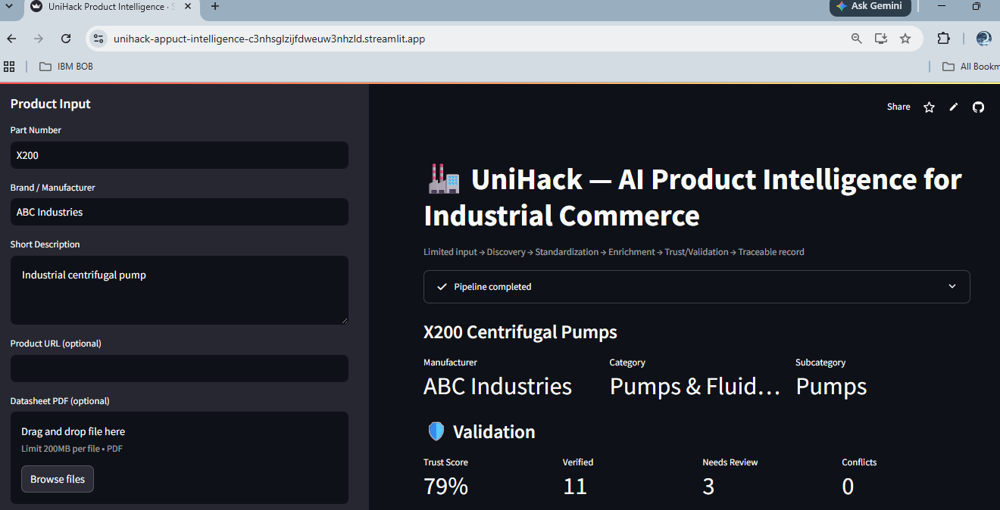
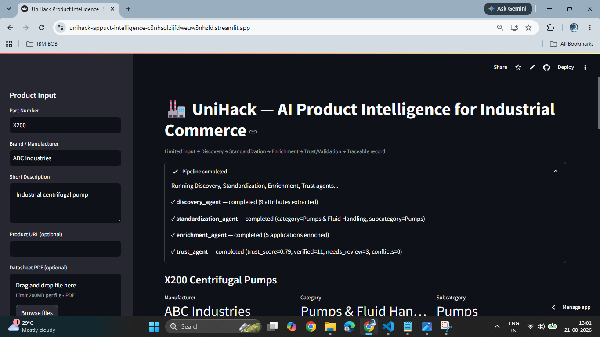
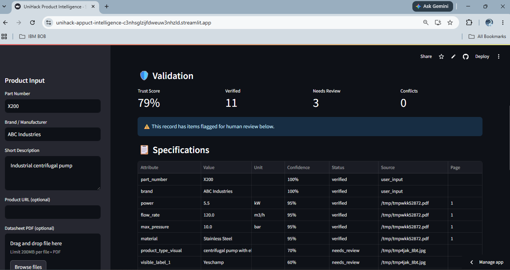
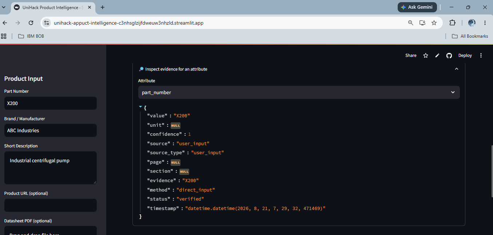
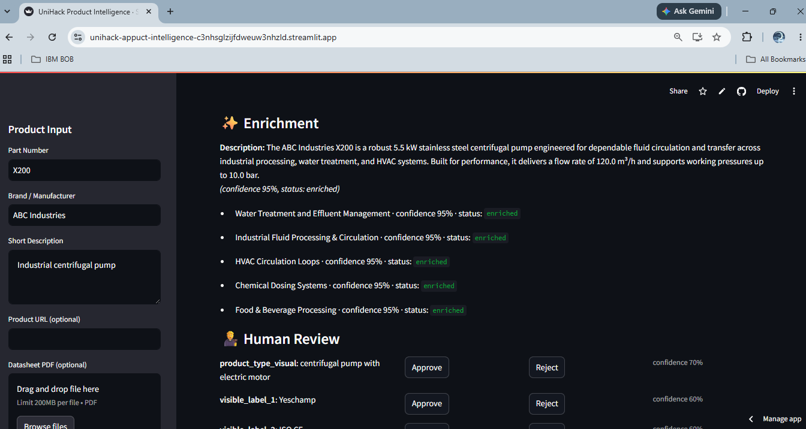
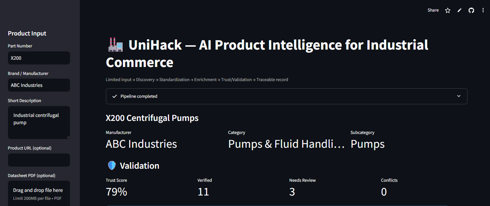

# UniHack — AI-Powered Product Intelligence for Industrial Commerce

## 1. Problem Statement

Industrial manufacturers manage product information scattered across websites,
catalogs, datasheets, PDFs, and images. Turning **limited** product input
(a part number, a brand, a short description — optionally a datasheet PDF or
photo) into **rich, structured, trustworthy** product intelligence is manual,
slow, and inconsistent across manufacturers.

## 2. Solution Overview

A 4-agent AI pipeline that takes minimal product input and produces a
structured, evidence-backed, validated product intelligence record:

```
Part Number + Brand + Description (+ optional PDF / Image / URL)
        │
        ▼
  AGENT 1  Discovery / Extraction        (PDF + vision document intelligence)
        │
        ▼
  AGENT 2  Classification & Standardization (schema mapping, unit normalization)
        │
        ▼
  AGENT 3  Enrichment (RAG)               (applications, description, context)
        │
        ▼
  AGENT 4  Trust / Validation             (rules, conflicts, confidence, trust score)
        │
        ▼
  Human Review (if flagged)  →  Final Traceable Product Intelligence
```

Every important attribute carries **value, unit, confidence, source,
source type, page/section, extraction method, and validation status** —
so a user can always inspect *why* the system believes a value is correct.

## 3. Architecture

```
unihack-product-intelligence/
├── agents/                  # the 4 agents, each independently testable
│   ├── discovery_agent.py
│   ├── standardization_agent.py
│   ├── enrichment_agent.py
│   └── trust_agent.py
├── models/                  # shared Pydantic state passed between agents
│   ├── product.py           # AttributeValue, ValidationSummary, etc.
│   └── state.py             # ProductState
├── services/                 # reusable, testable building blocks
│   ├── pdf_service.py       # PyMuPDF text/table extraction
│   ├── vision_service.py    # multimodal image analysis
│   ├── llm_service.py       # OpenAI / Gemini / mock, swappable via .env
│   ├── rag_service.py       # Chroma-based retrieval over data/knowledge_base
│   └── validation_service.py# deterministic rule checks
├── orchestrator.py          # LangGraph workflow wiring the 4 agents
├── main.py                  # FastAPI backend (/generate, /products)
├── app/streamlit_app.py     # Streamlit dashboard (standalone demo UI)
├── data/
│   ├── sample_products/     # uploaded datasheets/images land here
│   └── knowledge_base/      # trusted reference docs for RAG enrichment
├── tests/                   # unit + end-to-end tests
├── requirements.txt
├── .env.example
└── LICENSE
```

**Shared state:** every agent reads and writes the same `ProductState`
Pydantic object instead of inventing its own output format — this keeps the
pipeline composable, debuggable, and independently testable per agent.

## 4. The Four Agents

| Agent | Responsibility |
|---|---|
| **1. Discovery / Extraction** | Pulls text/tables from PDFs (PyMuPDF) and visually-verifiable facts from images (vision-language model). Every value is written with its evidence and source — nothing is invented. |
| **2. Classification & Standardization** | Maps manufacturer-specific field names ("Rated Power", "Motor Power", ...) onto a common schema (`power`), performs safe unit conversion (W→kW, mbar→bar), and classifies category/subcategory/family. |
| **3. Enrichment** | Uses RAG over a local knowledge base (Chroma) plus an LLM to propose applications, use cases, and a description — explicitly tagged `ENRICHED`, never presented as verified fact. |
| **4. Trust / Validation** | Runs deterministic rule checks (types, ranges, required fields), cross-source conflict detection, and computes attribute- and product-level confidence / trust scores. Flags anything uncertain for human review. |

## 5. Technology Stack

- **Backend:** Python, FastAPI
- **Orchestration:** LangGraph (with a sequential fallback if not installed)
- **AI:** OpenAI or Gemini, configurable via `.env` — with a deterministic
  **mock mode** so the whole pipeline runs offline / without API keys
- **Document processing:** PyMuPDF
- **Structured data:** Pydantic
- **RAG:** Chroma (falls back to naive keyword search if unavailable)
- **Database:** SQLite (swap-in-ready for PostgreSQL)
- **Frontend:** Streamlit

## 6. Setup Instructions

```bash
# 1. Clone and enter the project
cd unihack-product-intelligence

# 2. Create a virtual environment
python3 -m venv venv
source venv/bin/activate    # Windows: venv\Scripts\activate

# 3. Install dependencies
pip install -r requirements.txt

# 4. Configure environment
cp .env.example .env
# Edit .env and set MODEL_PROVIDER=openai (or gemini) + your API key,
# or leave MODEL_PROVIDER=mock to run fully offline.
```

## 7. Environment Variables

| Variable | Description |
|---|---|
| `MODEL_PROVIDER` | `openai` \| `gemini` \| `mock` (default) |
| `OPENAI_API_KEY` | required if `MODEL_PROVIDER=openai` |
| `GEMINI_API_KEY` | required if `MODEL_PROVIDER=gemini` |
| `MODEL_NAME` | model id, e.g. `gpt-4o-mini` or `gemini-1.5-flash` |
| `VALIDATION_CONFIDENCE_THRESHOLD` | below this, attributes → `needs_review` (default `0.75`) |
| `DB_PATH` | SQLite file path (default `unihack.db`) |
| `UPLOAD_DIR` | where uploaded PDFs/images are stored |

## 8. How to Run

**Option A — Streamlit dashboard (recommended for demo):**
```bash
streamlit run app/streamlit_app.py
```

**Option B — FastAPI backend:**
```bash
uvicorn main:app --reload
# then POST multipart/form-data to http://localhost:8000/generate
# with fields: part_number, brand, description, and optional pdf / image files
```

**Run tests:**
```bash
pytest -v
```

## 9. Example Input

```
Part Number: X200
Brand: ABC Industries
Description: Industrial centrifugal pump
Optional: X200_datasheet.pdf, X200_product.jpg
```

## 10. Example Output (abridged)

```json
{
  "product_name": "X200 Centrifugal Pump",
  "manufacturer": "ABC Industries",
  "category": "Industrial Equipment",
  "subcategory": "Pumps",
  "attributes": {
    "power": {
      "value": 5.5,
      "unit": "kw",
      "confidence": 0.96,
      "source": "X200_datasheet.pdf",
      "source_type": "pdf",
      "page": 3,
      "evidence": "Motor Power: 5.5 kW",
      "method": "pdf_extraction",
      "status": "verified"
    }
  },
  "applications": {
    "application_1": {
      "value": "Water Treatment",
      "confidence": 0.82,
      "status": "enriched",
      "source": "retrieved_knowledge"
    }
  },
  "validation": {
    "trust_score": 0.94,
    "verified_count": 8,
    "needs_review_count": 2,
    "conflict_count": 1
  },
  "human_review_required": true
}
```

## 11. Screenshots
## 11. Screenshots

**Product input form**


**4-agent pipeline execution**


**Structured specifications with confidence, status, source, and page**


**Evidence inspector — full traceability for any attribute**


**AI-enriched applications and description (RAG + LLM)**


**Trust score and validation summary**


## 12. Scalability

- Agents are stateless functions over `ProductState` → safe to run concurrently
  across many products (`Product N → Agent Pipeline → Product Intelligence`).
- No manufacturer-specific hardcoding: schema mapping and classification are
  rule/LLM-driven, not per-brand `if` statements.
- `services/` are swappable: SQLite → PostgreSQL, Chroma → a hosted vector DB,
  OpenAI ↔ Gemini via one env var — without touching agent logic.
- FastAPI endpoints are the seed for async/batch processing (e.g. a queue that
  calls `/generate` per catalog row).

## 13. Trust & Accuracy Strategy

- **Never hallucinate:** unknown is preferred over invented values.
- **Separate facts from inference:** every attribute is labeled `extracted`,
  `normalized`, `enriched`, `inferred`, `verified`, or `needs_review`.
- **Evidence preserved end-to-end:** source file, page, and verbatim-ish
  snippet are never discarded.
- **Deterministic rules where rules suffice**, LLM reasoning reserved for
  genuinely semantic steps (classification, enrichment synthesis).
- **Human-in-the-loop:** low confidence or cross-source conflicts always
  route to review rather than silent auto-approval.

## 14. USP / Differentiation

1. Multi-agent specialization (not four names for one blob of logic)
2. Evidence-first product intelligence with full traceability
3. Explicit trust layer with rule-based + cross-source validation
4. Multimodal (text + PDF + tables + images + retrieved knowledge)
5. Human-in-the-loop review for anything uncertain
6. Architecture designed for catalog-scale batch processing

## 15. Future Improvements

- OCR fallback for scanned (image-only) PDFs
- Richer cross-source conflict detection against live external/retrieved data
- Async batch processing endpoint for full catalog ingestion
- Auth + multi-tenant manufacturer workspaces
- PostgreSQL + hosted vector DB for production scale
- Editable review UI persisted back through `/products/{id}`

## 16. Notes on What's Mocked

- If no `OPENAI_API_KEY` / `GEMINI_API_KEY` is set, `MODEL_PROVIDER=mock`
  is used automatically: classification falls back to keyword rules and
  enrichment falls back to RAG-grounded-only output. This is clearly
  isolated in `services/llm_service.py` (`MockLLMClient`) — the rest of
  the pipeline (PDF extraction, normalization, validation, traceability)
  is fully real and functional with or without an API key.
